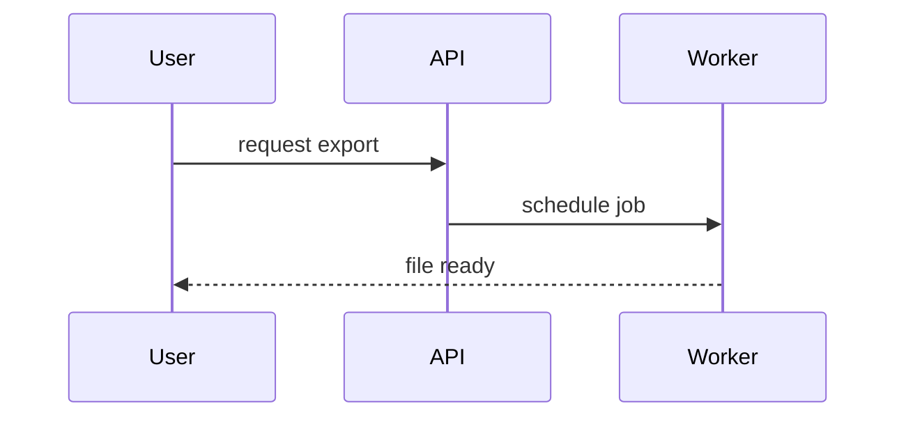

# Representations

Pick the smallest view that answers the reviewer's question. One view usually suffices; a larger change may need one per concern. Keep only the calls, files, fields, states, and boundaries needed for the point, and place each view beside the sentence it supports.

## When to skip a visual

- The diff is small and self-explanatory. A three-line change needs a sentence, not a copy of the three lines.
- The change is mechanical: a rename, a version bump, or regenerated output with no behavior change.
- The visual would repeat a table, list, or example already in the description.
- The change adds or rewords prose in existing files and the new text is the whole point. Describe it in a sentence; the diff shows the words. New files or directories still warrant a tree.

## Changed behavior

Use a `diff` of what users run or observe when the file diff does not show that behavior at a glance, for example when changed examples alter the commands users copy or a configuration change alters output:

```diff
- exports retry 42      # job stays failed
+ exports retry 42      # starts a new attempt
```

Use a `diff` of state or control flow when the logic itself is the point:

```diff
 on(retry)
-  schedule export
+  clear failure state
+  schedule export
```

## Structure and ownership

Show a move, split, or new reference directory as a shallow file tree, marking what the change adds or removes:

```diff
 src/exports/
 ├── retry.ts                # schedules a new attempt
+└── state/
+    ├── failure.ts          # clears the failure state
+    └── failure.test.ts
```

Show runtime order as a call tree, and interaction between components or services as a Mermaid sequence:

```text
submitExport
  validateRequest
  scheduleJob
    persistJob
```



Show user interface structure as a component tree, including state and module boundaries that matter:

```text
<ExportPage>
  useExportStatus()
  <RetryButton>
```

## Comparisons

Use a table when reviewers compare options, sources, versions, or contracts. A contrast between two things on one property fits one sentence; use a table for three or more items or more than one property:

| Source | Default `--timeout` |
|---|---|
| Reference page | 10 seconds |
| Release notes | 20 seconds |
| Implementation | 30 seconds |

## Output and evidence

Quote real output rather than paraphrasing it, trimmed to the lines that carry the point:

```text
✗ retry › clears the failure state before scheduling
  expected status "pending", received "failed"
```

Use a screenshot for a visual change when the environment can produce one. Describe what it shows in text as well.

## Complete examples

Show the whole block when most of it is new, when omitted context would hide ownership or order, or when readers need a copyable target shape.

The diff, tree, sequence, and complete-example shapes are adapted from HumanLayer's `show-me` skill by Dex Horthy (MIT); see [sources and scope](sources.md).
